# Lecture 01 — Basics of Computer, Turing Model and Von Neumann Model

**Subject:** Structured Programming (SP)  
**Program:** M.B.A. Tech. (AIML)  
**Semester:** I  
**Module:** 1 — Introduction to Algorithm and Flowchart  
**Lecture:** 01  
**Duration:** 1 Hour  
**Course Outcome:** CO1 — Understand the basic terminology used in computer programming.

---

## 1. Learning Objectives

After completing this lecture, you should be able to:

- Define a computer.
- Explain the basic Input-Process-Output model.
- Differentiate between data and instructions.
- Explain the concept of computation.
- Explain the meaning of a computational model.
- Describe the basic idea of the Turing Model.
- Identify the major components of a Turing Machine.
- Explain how a Turing Machine performs computation.
- Explain the basic idea of the Von Neumann Model.
- Identify the major components of the Von Neumann Model.
- Explain the stored-program concept.
- Describe the fetch-decode-execute cycle.
- Differentiate between the Turing Model and Von Neumann Model.
- Relate computation and computer organization to programming.

---

# 2. Introduction to Computers

A computer is an electronic system that accepts data, processes it according to instructions, and produces a result.

Computers are used in:

- Education
- Banking
- Healthcare
- Business
- Communication
- Entertainment
- Scientific research
- Artificial Intelligence
- Data Science
- Engineering
- Manufacturing

At a fundamental level:

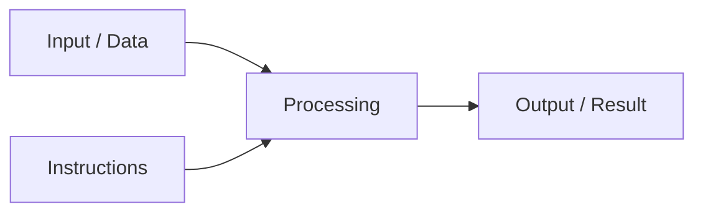

### Example

Suppose:

```text
A = 10
B = 20
```

Instruction:

```text
SUM = A + B
```

Output:

```text
SUM = 30
```

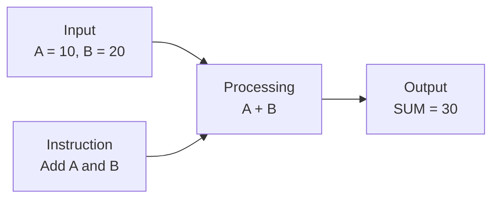

> **A computer processes data according to instructions to produce a desired result.**

---

# 3. Data

**Data** refers to raw facts, values, or information that can be processed by a computer.

Examples:

```text
25
100
85.5
Sachin
Mumbai
101101
```

Data can represent:

- Numbers
- Characters
- Names
- Text
- Images
- Audio
- Video
- Measurements
- Sensor readings

For example:

```text
A = 10
B = 20
```

Here, `10` and `20` are data.

---

# 4. Instructions

An **instruction** is a command that tells a computer what operation to perform.

For example:

```text
SUM = A + B
```

This instruction tells the computer to:

1. Take the value of `A`.
2. Take the value of `B`.
3. Add the two values.
4. Store the result in `SUM`.

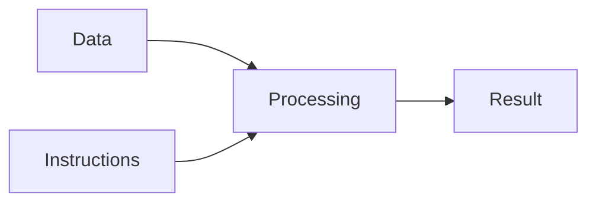

### Data vs Instructions

| Data | Instructions |
|---|---|
| Represents values or information | Specifies an operation |
| Provides what needs to be processed | Specifies what needs to be done |
| Example: `10`, `20` | Example: `SUM = A + B` |
| Used as input to computation | Controls the computation |

> A computer needs both **data** and **instructions** to perform useful computation.

---

# 5. What is Computation?

**Computation** is the process of performing operations on data according to a defined set of rules or instructions to produce a result.

Example:

```text
Input:
A = 15
B = 10

Instruction:
Subtract B from A

Computation:
15 - 10

Output:
5
```

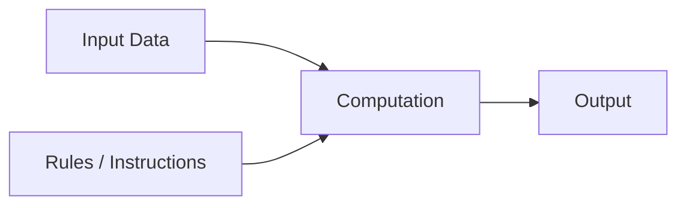

Computation may be simple, such as adding two numbers, or complex, such as:

- Training an AI model
- Processing an image
- Searching a large database
- Predicting weather
- Recognizing speech
- Processing financial transactions

---

# 6. What is a Model?

A **model** is a simplified representation of a real system, object, or process.

Examples:

| Real System | Model |
|---|---|
| City | Map |
| Electrical system | Circuit diagram |
| Building | Architectural plan |
| Business process | Flowchart |
| Computation | Computational model |
| Computer organization | Architecture model |

A model helps us understand something complex in a simpler way.

---

# 7. Computational Model

A **computational model** is a simplified representation of how computation can be performed.

It helps us understand:

- How data is represented.
- How instructions are executed.
- How data is manipulated.
- How a result is produced.
- What operations are possible.

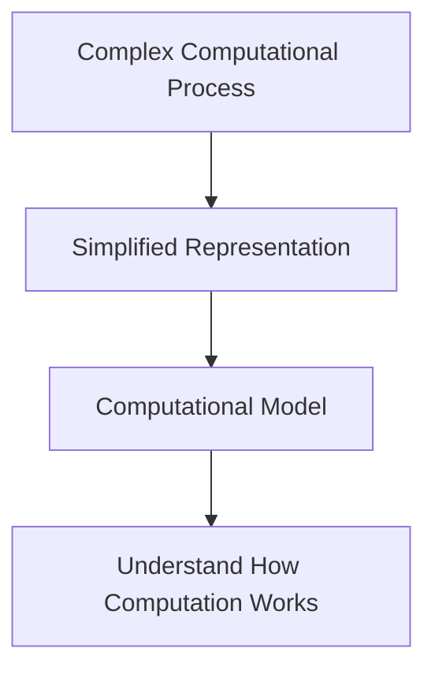

Two important models introduced in this lecture are:

1. **Turing Model** — theoretical model of computation.
2. **Von Neumann Model** — model of stored-program computer organization.

---

# 8. Turing Model

The **Turing Model** is a theoretical model of computation developed by **Alan Turing**.

The Turing Machine provides an abstract way of describing computation using:

- A tape for storing symbols.
- A read/write head.
- A set of states.
- Rules that determine what action should be performed.

The fundamental idea is:

> **A computation can be performed by manipulating symbols according to a finite set of rules.**

---

# 9. Turing Machine

A **Turing Machine** is an abstract mathematical model of computation.

It is not a physical computer such as a laptop or desktop.

It is used to study:

- What computation means.
- How algorithms can be represented.
- What problems can be solved computationally.
- How a machine can perform operations step by step.

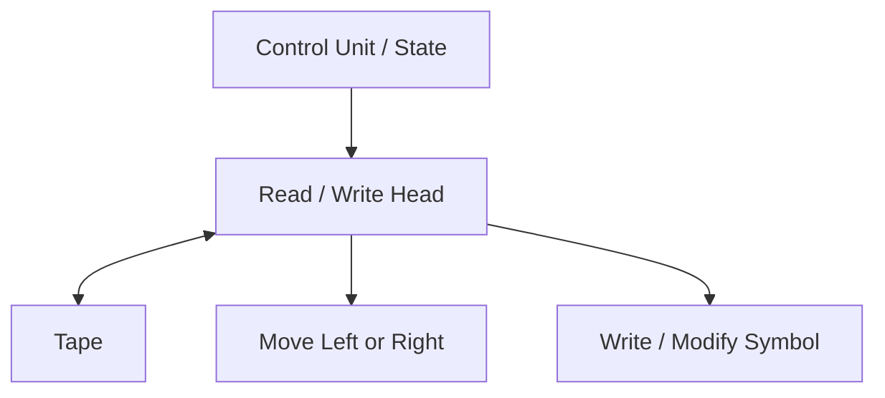

The three major conceptual components are:

1. **Tape**
2. **Read/Write Head**
3. **Control Unit / State Mechanism**

---

# 10. Tape

The tape stores symbols.

It consists conceptually of a sequence of cells.

```text
+----+----+----+----+----+----+
| □  | 1  | 0  | 1  | 1  | □  |
+----+----+----+----+----+----+
```

Each cell can contain a symbol.

The tape is considered **unbounded** in the theoretical model.

### Role of the Tape

The tape:

- Stores symbols.
- Provides input.
- Holds intermediate information.
- Can store output.
- Allows reading and writing of symbols.

The tape can be thought of as an abstract representation of memory, although it is not identical to modern computer memory.

---

# 11. Read/Write Head

The **Read/Write Head** interacts with the tape.

It can:

- Read the symbol in the current cell.
- Write a symbol into the current cell.
- Move one position left.
- Move one position right.

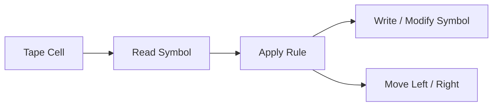

Example:

```text
+----+----+----+----+----+
| 1  | 0  | 1  | 1  | □  |
+----+----+----+----+----+
              ^
              |
         Read/Write Head
```

---

# 12. Control Unit and States

The **control unit** determines what the Turing Machine should do.

The machine has a finite set of **states**.

Its action depends on:

- Current state.
- Current symbol.
- Applicable transition rule.

The machine can:

- Write a symbol.
- Move left.
- Move right.
- Change its state.

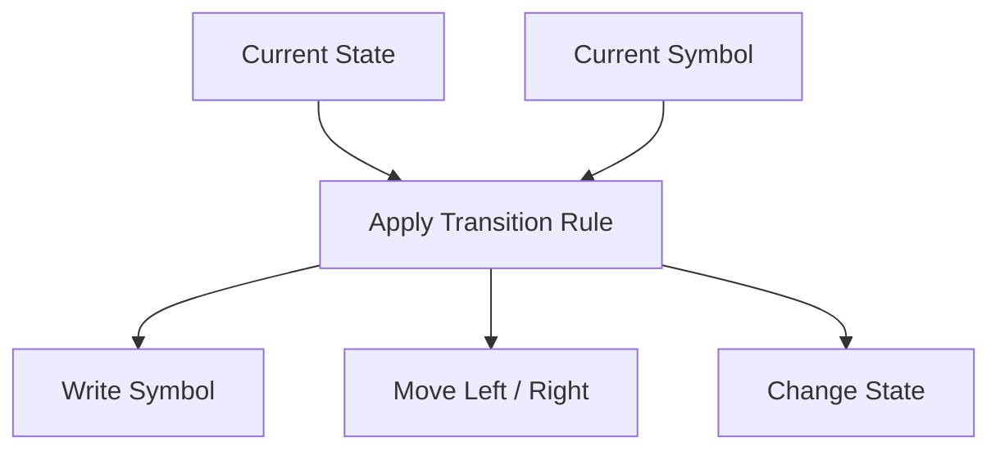

---

# 13. How Does a Turing Machine Perform Computation?

At each step:

1. The machine is in a particular state.
2. The head reads the current symbol.
3. The machine applies an appropriate rule.
4. It may write a new symbol.
5. It moves left or right.
6. It changes state.
7. The process continues.

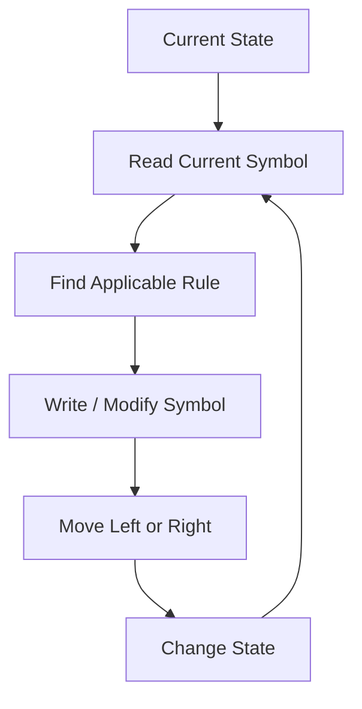

---

# 14. Simple Turing Machine Example

Suppose:

```text
+----+----+----+----+----+
| 1  | 1  | 1  | □  | □  |
+----+----+----+----+----+
              ^
              |
             Head
```

Suppose the rule is:

> If the current cell contains a blank symbol, write `1`.

The resulting tape becomes:

```text
+----+----+----+----+----+
| 1  | 1  | 1  | 1  | □  |
+----+----+----+----+----+
```

This demonstrates the basic principle:

> **The machine reads information, follows a rule, modifies information, and continues computation.**

---

# 15. Why Study the Turing Model?

The Turing Model introduces a fundamental idea:

> **Computation involves processing symbols or data according to defined rules.**

Programming is also based on this principle.

For example:

```c
sum = a + b;
```

The programmer specifies an operation to be performed on data.

The Turing Model therefore provides a theoretical foundation for understanding computation.

---

# 16. Von Neumann Model

The **Von Neumann Model** is a model of computer organization associated with **John von Neumann**.

It is based on the important concept that:

> **Instructions and data can be stored in the same memory.**

This is known as the **stored-program concept**.

The two models serve different purposes:

| Turing Model | Von Neumann Model |
|---|---|
| Theoretical model of computation | Model of computer organization |
| Explains computation conceptually | Explains organization of stored-program computers |
| Uses tape, head and states | Uses memory, CPU, input and output |
| Focuses on computation | Focuses on execution and organization |

---

# 17. Stored-Program Concept

The stored-program concept means:

> **A program, consisting of instructions, is stored in memory along with the data on which those instructions operate.**

Conceptually:

```text
+--------------------------------+
|            MEMORY              |
+--------------------------------+
| Instruction 1                  |
| Instruction 2                  |
| Instruction 3                  |
| Data 1                         |
| Data 2                         |
| Intermediate Result            |
+--------------------------------+
```

The CPU retrieves instructions from memory and executes them.

This is a fundamental characteristic of the Von Neumann Model.

---

# 18. Basic Components of Von Neumann Model

The basic components are:

1. **Input Unit**
2. **Memory Unit**
3. **Central Processing Unit (CPU)**
4. **Output Unit**

The CPU mainly contains:

- Arithmetic Logic Unit (ALU)
- Control Unit (CU)
- Registers

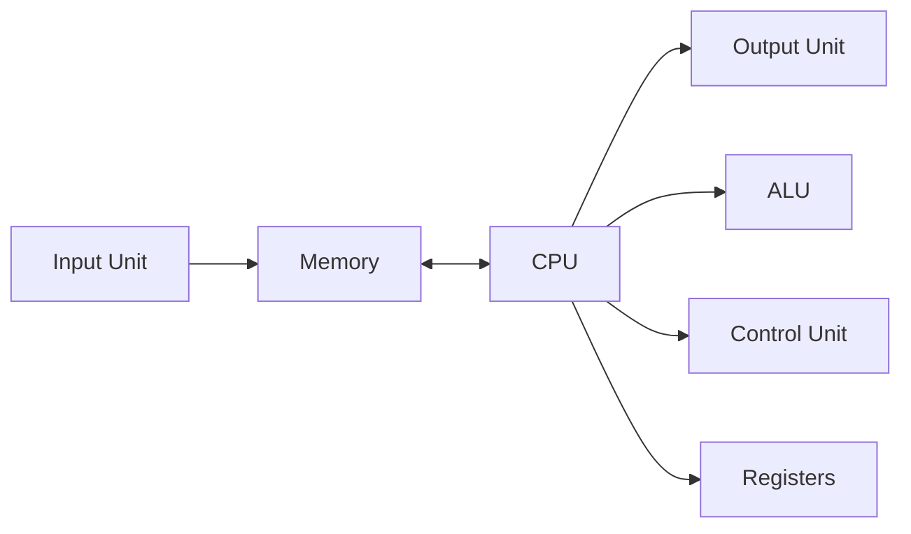

---

# 19. Input Unit

The **Input Unit** accepts data and instructions from the outside world.

Examples:

- Keyboard
- Mouse
- Scanner
- Microphone
- Camera
- Sensors

Example:

```text
User enters:
10
20
```

The input unit transfers this information into the computer system.

---

# 20. Memory Unit

The **Memory Unit** stores:

- Instructions
- Data
- Intermediate results
- Results

In the Von Neumann Model:

> **Instructions and data share the same memory system.**

Conceptually:

```text
+--------------------------------+
|            MEMORY              |
+--------------------------------+
| Program Instructions           |
| Program Instructions           |
| Data                           |
| Data                           |
| Intermediate Results           |
+--------------------------------+
```

---

# 21. Central Processing Unit — CPU

The **Central Processing Unit (CPU)** executes instructions and performs computations.

The CPU mainly consists of:

- Arithmetic Logic Unit (ALU)
- Control Unit (CU)
- Registers

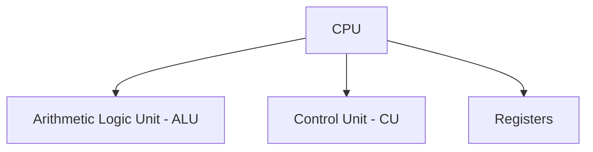

---

# 22. Arithmetic Logic Unit — ALU

The **Arithmetic Logic Unit (ALU)** performs arithmetic and logical operations.

### Arithmetic Operations

- Addition
- Subtraction
- Multiplication
- Division

### Logical / Comparison Operations

- AND
- OR
- NOT
- Greater than
- Less than
- Equal to

Example:

```text
10 + 20 = 30
```

The arithmetic operation is performed by the ALU.

---

# 23. Control Unit — CU

The **Control Unit (CU)** coordinates the activities of the computer.

It:

- Fetches instructions from memory.
- Decodes instructions.
- Controls execution.
- Coordinates CPU and memory operations.
- Coordinates input/output operations.

The basic process is:

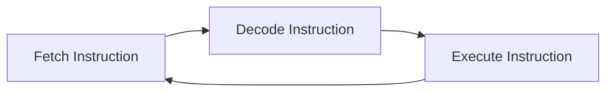

This is called the:

> **Fetch-Decode-Execute Cycle**

---

# 24. Registers

**Registers** are very small and very fast storage locations inside the CPU.

They temporarily hold:

- Data
- Instructions
- Addresses
- Intermediate results

Examples include:

- Program Counter
- Instruction Register
- Accumulator
- General-purpose registers

The exact registers depend on the processor architecture.

---

# 25. Output Unit

The **Output Unit** provides processing results to the user or another system.

Examples:

- Monitor
- Printer
- Speakers
- Display panels

Example:

```text
Input:
10
20

Processing:
10 + 20

Output:
30
```

The result `30` can be displayed on a monitor.

---

# 26. How the Von Neumann Model Works

Consider:

```text
SUM = A + B
```

where:

```text
A = 10
B = 20
```

A simplified process is:

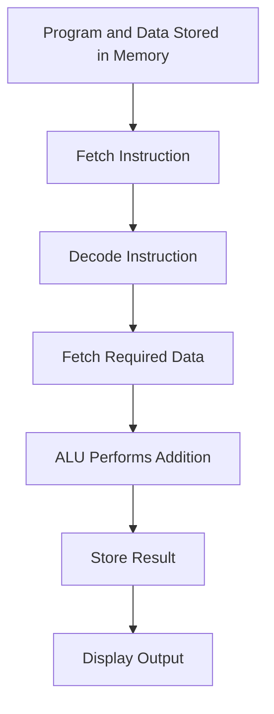

The CPU repeatedly fetches and executes instructions stored in memory.

---

# 27. Fetch-Decode-Execute Cycle

The CPU generally executes instructions through a repeated cycle.

## Step 1 — Fetch

The CPU obtains the next instruction from memory.

```text
Memory → CPU
```

## Step 2 — Decode

The Control Unit determines what the instruction means and what operation is required.

## Step 3 — Execute

The CPU performs the required operation.

This may involve:

- ALU operations
- Moving data
- Accessing memory
- Changing program flow

## Step 4 — Store

The result may be stored in a register or memory.

The cycle then repeats.

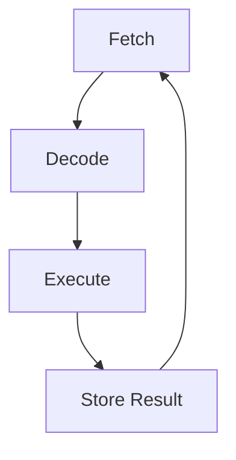

---

# 28. Example Using a C Program

Consider:

```c
sum = a + b;
```

Suppose:

```text
a = 10
b = 20
```

A simplified view is:

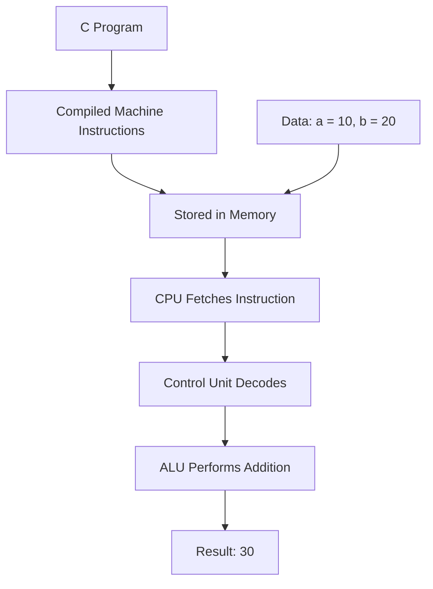

The actual execution process inside a modern processor is more complex, but this model provides a useful conceptual understanding.

---

# 29. Von Neumann Model and Programming

The Von Neumann Model helps explain how a program written by a programmer becomes an executing computation.

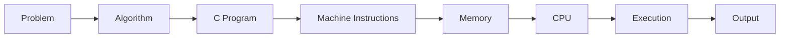

When we write a C program, it is eventually translated into machine-level instructions that the processor can execute.

---

# 30. Turing Model vs Von Neumann Model

| Feature | Turing Model | Von Neumann Model |
|---|---|---|
| Nature | Theoretical | Computer organization model |
| Associated with | Alan Turing | John von Neumann |
| Main purpose | Study computation | Explain stored-program computer organization |
| Storage | Abstract tape | Memory |
| Processing mechanism | State transitions and read/write head | CPU |
| Control | States and transition rules | Control Unit |
| Computation | Symbol manipulation | Instruction execution |
| Practical focus | Theoretical foundation | Practical computer architecture |
| Main concept | Computability | Stored-program concept |

### Easy Way to Remember

```text
Turing Model
      ↓
"What is computation?"
      ↓
Theoretical foundation
```

```text
Von Neumann Model
      ↓
"How is a stored-program computer organized?"
      ↓
Computer organization
```

---

# 31. From Problem to Program Execution

The concepts introduced in this lecture form the foundation for Structured Programming.

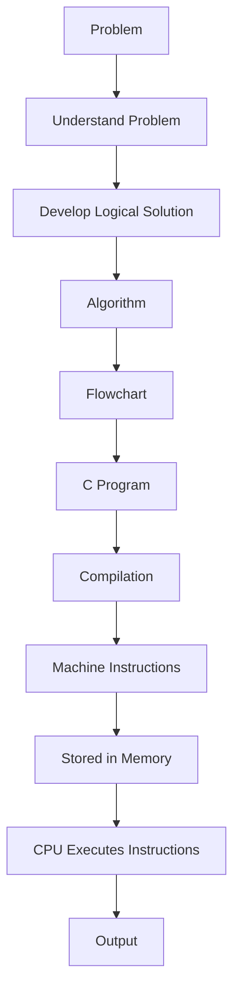

The overall idea is:

> **A programming problem is transformed into a logical solution, represented as an algorithm and flowchart, implemented using C, translated into machine instructions, and executed by the computer.**

---

# 32. Why Are These Models Important?

Structured Programming is not only about learning C syntax.

The objective is to develop the ability to solve problems systematically.

We will gradually learn:

1. How computers perform computation.
2. How problems can be analyzed.
3. How solutions can be represented as algorithms.
4. How algorithms can be represented using flowcharts.
5. How algorithms can be implemented using C.
6. How C programs are translated and executed.
7. How programming constructs control execution.

The Turing Model gives us a theoretical foundation for understanding computation.

The Von Neumann Model gives us a foundation for understanding stored-program computer organization.

---

# 33. Important Terminology

| Term | Meaning |
|---|---|
| **Computer** | An electronic system that processes data according to instructions. |
| **Data** | Facts, values, or information that can be processed. |
| **Instruction** | A command specifying an operation to be performed. |
| **Computation** | Processing data according to defined rules or instructions to produce a result. |
| **Model** | A simplified representation of a system or process. |
| **Computational Model** | A simplified representation used to understand how computation can be performed. |
| **Turing Model** | A theoretical model used to study computation. |
| **Turing Machine** | An abstract mathematical model of computation. |
| **Tape** | An abstract sequence of cells used by a Turing Machine to store symbols. |
| **Read/Write Head** | Component that reads and writes symbols on the Turing Machine tape. |
| **State** | A condition of a Turing Machine that helps determine its next action. |
| **Transition Rule** | A rule that determines the next action of a Turing Machine. |
| **Von Neumann Model** | A computer organization model based on the stored-program concept. |
| **Stored-Program Concept** | The concept of storing instructions and data in memory. |
| **CPU** | The primary processing unit responsible for executing instructions. |
| **ALU** | Unit that performs arithmetic and logical operations. |
| **Control Unit** | CPU component that coordinates instruction execution. |
| **Register** | Small, fast storage location inside the CPU. |
| **Fetch** | Obtaining an instruction from memory. |
| **Decode** | Determining what an instruction means. |
| **Execute** | Performing the operation specified by an instruction. |

---

# 34. Common Misconceptions

### Misconception 1: A Turing Machine is an actual computer.

**Correction:**  
A Turing Machine is an abstract mathematical model used to study computation.

### Misconception 2: The Turing Model and Von Neumann Model are the same.

**Correction:**  

- Turing Model → theoretical model of computation.
- Von Neumann Model → model of stored-program computer organization.

### Misconception 3: Memory stores only data.

**Correction:**  
In the Von Neumann Model, memory stores both **instructions and data**.

### Misconception 4: The CPU stores the entire program permanently.

**Correction:**  
Programs and data are stored in memory/storage. The CPU fetches instructions and processes them during execution.

---

# 35. Check Your Understanding

## Question 1

What is a computer?

**Answer:**  
A computer is an electronic system that accepts data, processes it according to instructions, and produces an output.

---

## Question 2

What is the difference between data and instructions?

**Answer:**  
Data represents values or information to be processed, while instructions specify the operations to be performed on that data.

---

## Question 3

What is computation?

**Answer:**  
Computation is the process of performing operations on data according to defined rules or instructions to produce a result.

---

## Question 4

What is a computational model?

**Answer:**  
A computational model is a simplified representation used to describe and understand how computation can be performed.

---

## Question 5

What is the Turing Model?

**Answer:**  
The Turing Model is an abstract theoretical model of computation based on a tape, read/write head, states, and transition rules.

---

## Question 6

What are the major components of a Turing Machine?

**Answer:**

1. Tape
2. Read/Write Head
3. Control Unit / State Mechanism

---

## Question 7

What is the stored-program concept?

**Answer:**  
The stored-program concept means that program instructions and data are stored in memory and can be accessed by the CPU during execution.

---

## Question 8

What are the major components of the Von Neumann Model?

**Answer:**

1. Input Unit
2. Memory Unit
3. CPU
4. Output Unit

The CPU contains the ALU, Control Unit, and registers.

---

## Question 9

What is the role of the ALU?

**Answer:**  
The ALU performs arithmetic, logical, and comparison operations.

---

## Question 10

What is the fetch-decode-execute cycle?

**Answer:**  
It is the repeated process in which the CPU fetches an instruction from memory, decodes it, executes it, and proceeds to the next instruction.

---

## Question 11

Differentiate between the Turing Model and Von Neumann Model.

**Answer:**  

The Turing Model is a theoretical model used to understand computation, while the Von Neumann Model describes the organization of a stored-program computer using memory, CPU, input, and output.

---

# 36. Practice Questions

## Short Answer Questions

1. Define a computer.
2. Define data.
3. Define an instruction.
4. What is computation?
5. What is a model?
6. What is a computational model?
7. What is the Turing Model?
8. What is a Turing Machine?
9. What is the purpose of the tape?
10. What is the function of the Read/Write Head?
11. What is a state in a Turing Machine?
12. What is a transition rule?
13. What is the Von Neumann Model?
14. What is the stored-program concept?
15. What is the function of memory?
16. What is the function of the ALU?
17. What is the function of the Control Unit?
18. What are registers?
19. What is the fetch-decode-execute cycle?
20. Differentiate between the Turing Model and Von Neumann Model.

## Descriptive Questions

1. Explain the Input-Process-Output model of a computer with a suitable example.
2. Differentiate between data and instructions with suitable examples.
3. Explain the concept of computation.
4. Explain the concept of a computational model.
5. Explain the Turing Model and its major components.
6. Explain the working of a Turing Machine.
7. Explain the role of the tape, Read/Write Head, and control mechanism.
8. Explain the Von Neumann Model with a suitable diagram.
9. Explain the stored-program concept.
10. Explain the major components of the Von Neumann Model.
11. Explain the fetch-decode-execute cycle.
12. Differentiate between the Turing Model and Von Neumann Model.
13. Explain how the concepts introduced in this lecture are related to programming.

---

# 37. Activity

Consider the problem:

> **Calculate the average of three numbers.**

### Input

```text
A, B, C
```

### Instruction

```text
Average = (A + B + C) / 3
```

### Output

```text
Average
```

Represent the process:

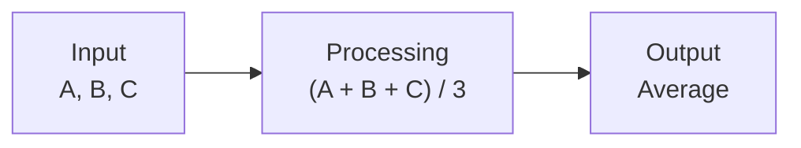

### Think About It

Before writing a C program, what should we do to clearly describe the solution?

This leads to the next topics:

> **Algorithm and Flowchart**

---

# 38. Summary

In this lecture, we learned that a computer processes data according to instructions.

The basic computational process is:

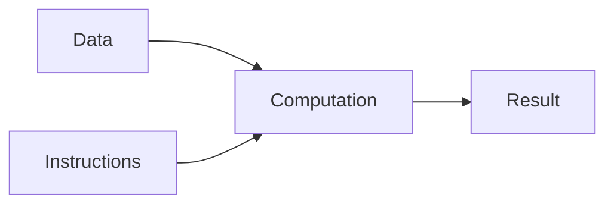

We introduced the concept of computational models and studied two important models.

### Turing Model

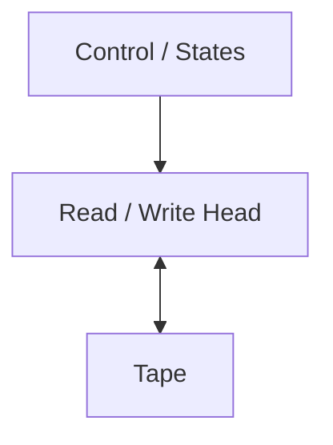

The Turing Model provides a theoretical foundation for understanding computation.

### Von Neumann Model

```mermaid
flowchart LR
    A[Input] --> B[Memory]
    B <--> C[CPU]
    C --> D[Output]
```

The Von Neumann Model provides a conceptual foundation for understanding stored-program computers.

The most important ideas to remember are:

> **Computation is the systematic processing of data according to defined instructions or rules to produce a result.**

> **The Turing Model explains computation theoretically, while the Von Neumann Model explains the organization of a stored-program computer.**

---

# 39. Exam-Oriented Revision

## Must Know

- Definition of computer.
- Input-Process-Output concept.
- Difference between data and instructions.
- Definition of computation.
- Definition of computational model.
- Definition of Turing Model.
- Definition of Turing Machine.
- Components of Turing Machine.
- Function of tape.
- Function of Read/Write Head.
- Role of states and transition rules.
- Definition of Von Neumann Model.
- Stored-program concept.
- Components of Von Neumann Model.
- Function of CPU.
- Function of ALU.
- Function of Control Unit.
- Function of registers.
- Fetch-decode-execute cycle.
- Difference between Turing Model and Von Neumann Model.

## Important Conceptual Questions

### Question 1

> **Explain the Turing Model and describe the major components of a Turing Machine.**

A good answer should include:

1. Definition of Turing Model.
2. Definition of Turing Machine.
3. Tape.
4. Read/Write Head.
5. Control Unit / States.
6. Transition rules.
7. Basic working.
8. Suitable diagram.

### Question 2

> **Explain the Von Neumann Model with a suitable diagram.**

A good answer should include:

1. Definition of Von Neumann Model.
2. Stored-program concept.
3. Input Unit.
4. Memory Unit.
5. CPU.
6. ALU.
7. Control Unit.
8. Registers.
9. Output Unit.
10. Suitable block diagram.

### Question 3

> **Differentiate between the Turing Model and Von Neumann Model.**

Focus on:

- Purpose
- Nature
- Storage
- Processing mechanism
- Control mechanism
- Practical vs theoretical perspective

---

# 40. Quick Revision

```text
COMPUTER
   ↓
Accepts Data
   ↓
Processes Data
   ↓
According to Instructions
   ↓
Produces Result
```

```text
TURING MODEL
   ↓
Tape
   +
Read/Write Head
   +
States & Rules
   ↓
Symbol Manipulation
   ↓
Computation
```

```text
VON NEUMANN MODEL
   ↓
Input
   ↓
Memory ↔ CPU
   ↓
Output

CPU
 ├── ALU
 ├── Control Unit
 └── Registers
```

```text
CPU INSTRUCTION CYCLE

Fetch
  ↓
Decode
  ↓
Execute
  ↓
Store
  ↓
Fetch Next Instruction
```

```text
PROBLEM
   ↓
ALGORITHM
   ↓
FLOWCHART
   ↓
C PROGRAM
   ↓
COMPILATION
   ↓
MACHINE INSTRUCTIONS
   ↓
MEMORY
   ↓
CPU EXECUTION
   ↓
OUTPUT
```

---

# 41. Key Takeaways

1. A computer processes **data according to instructions**.
2. Computation transforms input into output according to defined rules.
3. A computational model provides a simplified way to understand computation.
4. The **Turing Model** is a theoretical model of computation.
5. A Turing Machine uses a **tape, read/write head, states, and transition rules**.
6. The **Von Neumann Model** describes a stored-program computer organization.
7. In the Von Neumann Model, **instructions and data are stored in memory**.
8. The CPU contains the **ALU, Control Unit, and registers**.
9. The CPU repeatedly follows the **fetch-decode-execute cycle**.
10. These concepts provide the foundation for understanding algorithms, flowcharts, programming languages, and C programming.

---

# 42. Next Lecture

## Lecture 02 — Types of Programming Languages and Introduction to Algorithms

The next lecture will continue Module 1 and cover:

- Programming languages
- Why programming languages are required
- Machine language
- Assembly language
- High-level languages
- Generations of programming languages
- Examples of programming languages
- Position of C among programming languages
- Introduction to problem solving
- What is an algorithm?
- Characteristics of a good algorithm
- Why algorithms are required before programming

The next lecture will begin connecting the computer concepts studied here with the actual process of solving programming problems.
