# Lecture 02 — Types of Programming Languages and Introduction to Algorithms

**Subject:** Structured Programming (SP)  
**Program:** M.B.A. Tech. (AIML)  
**Semester:** I  
**Module:** 1 — Introduction to Algorithm and Flowchart  
**Lecture:** 02  
**Duration:** 1 Hour  
**Course Outcome:** CO1 — Understand the basic terminology used in computer programming.

---

## 1. Learning Objectives

After completing this lecture, you should be able to:

- Explain why programming languages are required.
- Define a programming language.
- Explain machine language.
- Explain assembly language.
- Explain high-level programming languages.
- Differentiate between machine, assembly, and high-level languages.
- Explain the generations of programming languages.
- Identify examples of programming languages from different generations.
- Explain the position and importance of C programming language.
- Define problem solving in programming.
- Explain the steps involved in solving a programming problem.
- Define an algorithm.
- Explain the characteristics of a good algorithm.
- Understand why an algorithm should be developed before writing a program.
- Relate algorithms to C programming.

---

# 2. Recap of Lecture 01

In the previous lecture, we studied:

- Basic concept of a computer.
- Data and instructions.
- Computation.
- Computational models.
- Turing Model.
- Turing Machine.
- Von Neumann Model.
- Stored-program concept.
- CPU, ALU, Control Unit and Registers.
- Fetch-Decode-Execute cycle.

The overall idea was:

```text
Problem
   ↓
Logical Solution
   ↓
Algorithm
   ↓
Program
   ↓
Execution
   ↓
Output
```

In this lecture, we will start understanding **programming languages** and then move toward **algorithms**.

---

# 3. What is a Programming Language?

A **programming language** is a formal language used by programmers to write instructions that can be translated and executed by a computer.

A programming language provides:

- Rules for writing instructions.
- Syntax for constructing programs.
- Keywords and symbols.
- Data types.
- Operators.
- Control structures.
- Functions and other programming constructs.

Examples:

```text
C
C++
Java
Python
JavaScript
C#
Go
Rust
```

For example:

```c
printf("Hello World");
```

This is an instruction written using the syntax of the C programming language.

---

# 4. Why Do We Need Programming Languages?

A computer ultimately executes instructions represented in **machine language**.

Humans, however, prefer to express solutions using understandable words, symbols and logical structures.

Therefore, programming languages provide a bridge between:

```text
Human Problem
      ↓
Human-readable Program
      ↓
Translation
      ↓
Machine Instructions
      ↓
Computer Execution
```

### Example

A human may think:

```text
Add two numbers and display the result.
```

In C, this can be expressed as:

```c
int sum = a + b;
printf("%d", sum);
```

The C program is then translated into instructions that the processor can execute.

---

# 5. Levels of Programming Languages

Programming languages can be broadly classified according to how close they are to the hardware.

```text
Closer to Hardware
        ↑
        |
Machine Language
        |
Assembly Language
        |
High-Level Language
        |
        ↓
Closer to Human Thinking
```

The major categories discussed in this lecture are:

1. Machine Language
2. Assembly Language
3. High-Level Languages

---

# 6. Machine Language

**Machine language** is the lowest-level programming language that consists of instructions directly represented in binary or machine-readable form.

It uses combinations of:

```text
0
1
```

Example:

```text
10110000 01100001
```

The exact representation depends on the processor architecture.

Machine language instructions are directly interpreted by the CPU.

---

# 7. Characteristics of Machine Language

Machine language has the following characteristics:

- Uses binary instructions.
- Is directly associated with the processor architecture.
- Does not require translation from another programming language before execution.
- Is difficult for humans to read and write.
- Is difficult to debug and maintain.
- Programs are generally hardware-dependent.

Conceptually:

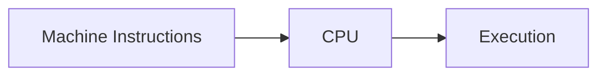

---

# 8. Advantages of Machine Language

### 1. Direct Execution

Machine instructions are directly understood by the processor.

### 2. Hardware Specific

Instructions can make use of specific processor capabilities.

### 3. No High-Level Language Translation

A machine-language program does not need to be converted from a high-level language before the CPU can execute it.

---

# 9. Disadvantages of Machine Language

### 1. Difficult to Write

Binary instructions are difficult for humans to understand.

### 2. Difficult to Debug

Finding errors in long sequences of binary instructions is difficult.

### 3. Difficult to Maintain

Changing or modifying programs is difficult.

### 4. Hardware Dependent

A program designed for one processor architecture may not work on another architecture.

### 5. Poor Readability

The program does not clearly express the programmer's intention.

---

# 10. Assembly Language

**Assembly language** is a low-level programming language that uses symbolic instructions called **mnemonics** instead of raw binary instructions.

Example:

```asm
MOV AX, 10
ADD AX, 20
```

Here:

```text
MOV → Move data
ADD → Add
```

The symbolic instructions are easier for humans to understand than binary machine instructions.

---

# 11. Assembler

An **assembler** is a system program that translates assembly language instructions into machine language instructions.

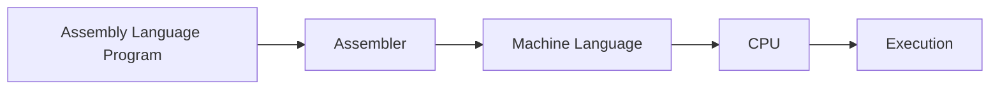

Therefore:

```text
Assembly Language
       ↓
    Assembler
       ↓
Machine Language
       ↓
      CPU
```

---

# 12. Mnemonics

A **mnemonic** is a symbolic word or abbreviation used to represent a machine-level operation.

Examples:

| Mnemonic | General Meaning |
|---|---|
| `MOV` | Move data |
| `ADD` | Addition |
| `SUB` | Subtraction |
| `MUL` | Multiplication |
| `DIV` | Division |
| `JMP` | Jump |
| `CMP` | Compare |

The exact instructions and syntax depend on the processor architecture.

---

# 13. Characteristics of Assembly Language

Assembly language:

- Uses symbolic instructions.
- Uses mnemonics.
- Is closer to hardware than high-level languages.
- Is generally processor-specific.
- Requires an assembler.
- Is easier to understand than machine language.
- Provides relatively direct control over hardware resources.

---

# 14. Advantages of Assembly Language

### 1. Easier Than Machine Language

Symbolic instructions are more readable than binary.

### 2. Hardware Control

It can provide detailed control over processor operations.

### 3. Efficient Programs

Assembly can be used where careful control of processor resources is important.

### 4. Useful for Low-Level Programming

It is relevant to areas such as:

- Embedded systems
- Device drivers
- Operating system components
- Microcontroller programming
- Performance-critical low-level code

---

# 15. Disadvantages of Assembly Language

- More difficult to write than high-level languages.
- Processor dependent.
- Requires knowledge of hardware architecture.
- Programs can become lengthy and difficult to maintain.
- Less portable than high-level languages.

---

# 16. High-Level Programming Languages

A **high-level programming language** provides programming constructs that are relatively close to human reasoning and abstract away many hardware-level details.

Examples include:

```text
C
C++
Java
Python
C#
Go
Rust
JavaScript
```

Example in C:

```c
int a = 10;
int b = 20;

int sum = a + b;

printf("%d", sum);
```

The programmer does not need to specify individual processor instructions for every operation.

---

# 17. Characteristics of High-Level Languages

High-level languages generally provide:

- Readable syntax.
- Variables.
- Data types.
- Functions.
- Control structures.
- Arrays and other data structures.
- Abstraction from hardware details.
- Better portability.
- Easier debugging and maintenance.

Example:

```c
if (marks >= 40)
{
    printf("Pass");
}
else
{
    printf("Fail");
}
```

The programmer can express a decision directly rather than manually specifying processor-level instructions.

---

# 18. Translation of High-Level Programs

A high-level program must generally be translated into machine instructions before execution.

For compiled languages such as C:

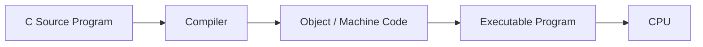

Conceptually:

```text
C Program
   ↓
Compiler
   ↓
Machine-Level Code
   ↓
Executable
   ↓
CPU
   ↓
Execution
```

The actual build process can involve additional steps such as preprocessing, compilation, assembly and linking.

---

# 19. Compiler

A **compiler** is a software system that translates a source program written in a programming language into another form, commonly machine code or an intermediate representation, so that it can ultimately be executed.

For a C program, the process can be represented conceptually as:

```text
C Source Code
      ↓
Preprocessing
      ↓
Compilation
      ↓
Assembly
      ↓
Linking
      ↓
Executable
```

A compiler can also detect many programming errors during translation.

---

# 20. Interpreter

An **interpreter** is a program that executes source code through an execution environment rather than producing a standalone native executable in the same traditional way as a compiler.

The exact execution model varies among languages and implementations.

Conceptually:

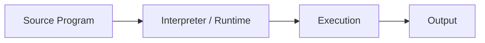

Examples of languages commonly associated with interpreted or runtime-based execution include Python and JavaScript, although modern implementations may use compilation, bytecode, JIT compilation, or other techniques.

> **Important:** The distinction between "compiled" and "interpreted" is useful for beginners, but modern language implementations can combine both approaches.

---

# 21. Compiler vs Interpreter

| Compiler | Interpreter |
|---|---|
| Translates source code as part of a compilation process | Executes source through an interpreter/runtime |
| Commonly produces machine code or another executable representation | May execute instructions or an intermediate representation dynamically |
| Many errors can be detected before execution | Some errors appear when the relevant code is executed |
| Common in C/C++ | Commonly associated with Python/JavaScript |
| Execution can be efficient after compilation | Runtime execution may involve additional interpretation or compilation |

> The exact implementation depends on the language and its runtime environment.

---

# 22. Machine vs Assembly vs High-Level Language

| Feature | Machine Language | Assembly Language | High-Level Language |
|---|---|---|---|
| Representation | Binary / machine instructions | Mnemonics | Human-readable syntax |
| Abstraction | Very low | Low | Higher |
| Hardware dependency | Very high | High | Generally lower |
| Readability | Very difficult | Moderate | High |
| Translation | Directly executed by CPU | Assembler | Compiler/interpreter/runtime |
| Portability | Very low | Low | Generally higher |
| Ease of programming | Very difficult | Difficult | Easier |
| Example | Binary instruction | `MOV AX, 10` | `sum = a + b;` |

---

# 23. Generations of Programming Languages

Programming languages are also commonly discussed in terms of **generations**.

The traditional classification is:

```text
1GL → Machine Language
2GL → Assembly Language
3GL → High-Level Languages
4GL → Very High-Level / Problem-Oriented Languages
5GL → Logic / Constraint / Knowledge-Oriented Languages
```

This classification is historical and simplified. Modern languages and programming paradigms do not always fit neatly into a single generation.

---

# 24. First Generation Languages — 1GL

**First Generation Languages (1GL)** refer to machine languages.

Characteristics:

- Binary representation.
- Directly associated with hardware.
- Very difficult for humans to write.
- Processor-specific.

Example:

```text
10110100 00001010
```

Conceptually:

```text
1GL
 ↓
Machine Instructions
 ↓
CPU
```

---

# 25. Second Generation Languages — 2GL

**Second Generation Languages (2GL)** generally refer to assembly languages.

Characteristics:

- Use mnemonics.
- Easier than machine language.
- Hardware-specific.
- Require an assembler.

Example:

```asm
MOV AX, 10
ADD AX, 20
```

Conceptually:

```text
2GL
 ↓
Assembly
 ↓
Assembler
 ↓
Machine Code
```

---

# 26. Third Generation Languages — 3GL

**Third Generation Languages (3GL)** refer to high-level programming languages.

Examples:

```text
C
C++
Java
FORTRAN
COBOL
Pascal
Python
```

Characteristics:

- More human-readable.
- Provide higher-level abstractions.
- Easier to develop and maintain.
- Generally more portable than assembly language.

Example:

```c
sum = a + b;
```

This is much easier to understand than the equivalent low-level instructions.

---

# 27. Fourth Generation Languages — 4GL

**Fourth Generation Languages (4GL)** are generally designed to allow programmers to express solutions at a higher level, often closer to a specific application domain or desired result.

Examples may include:

- SQL
- Report-generation languages
- Database-oriented languages
- Certain application-specific tools

Example:

```sql
SELECT name, salary
FROM employee
WHERE salary > 50000;
```

The programmer specifies **what information is required** rather than describing every low-level step needed to retrieve it.

> 4GL is a broad historical classification, and SQL is often described as a 4GL or declarative language in introductory texts.

---

# 28. Fifth Generation Languages — 5GL

**Fifth Generation Languages (5GL)** are commonly associated with logic, constraints, knowledge representation, and problem-solving systems.

Examples often discussed include:

```text
Prolog
Constraint-based programming systems
```

The idea is to describe:

- Facts
- Rules
- Constraints
- Relationships

rather than explicitly specifying every procedural step.

Example concept:

```text
Fact:
Human(Sachin)

Rule:
Human(X) → Mortal(X)
```

A logic-based system can use the facts and rules to derive conclusions.

---

# 29. Programming Language Generations — Quick View

```text
1GL
 ↓
Machine Language
 ↓
Binary Instructions

2GL
 ↓
Assembly Language
 ↓
Mnemonics

3GL
 ↓
High-Level Languages
 ↓
C, C++, Java, Python

4GL
 ↓
Very High-Level / Domain-Oriented Languages
 ↓
SQL and similar systems

5GL
 ↓
Logic / Constraint / Knowledge-Oriented Systems
 ↓
Prolog and related approaches
```

---

# 30. Where Does C Fit?

C is generally classified as a **third-generation high-level programming language**.

However, C also provides relatively low-level capabilities.

For example, C supports:

- Pointers
- Direct memory-related operations
- Bitwise operators
- Manual dynamic memory management
- Structures
- Functions
- Arrays

Therefore, C is often described as a language that combines:

```text
High-Level Abstraction
        +
Low-Level Control
```

This makes C particularly useful for understanding how software interacts with computer hardware.

---

# 31. Why Learn C in Structured Programming?

C is especially useful for learning programming fundamentals because it exposes important concepts clearly.

Through C, students can learn:

- Variables
- Data types
- Operators
- Expressions
- Conditional statements
- Loops
- Arrays
- Strings
- Functions
- Structures
- Pointers
- Dynamic memory allocation

These concepts also form a strong foundation for learning other programming languages.

---

# 32. C and AIML

For students of **Artificial Intelligence and Machine Learning**, learning structured programming is still important.

Although many AIML applications use Python, understanding C helps students understand:

- Memory
- Data representation
- Algorithms
- Computational efficiency
- Arrays and data structures
- Pointers
- Dynamic memory
- Low-level execution
- How higher-level software ultimately runs on computer hardware

Conceptually:

```text
C Programming
      ↓
Programming Fundamentals
      ↓
Algorithms + Data Structures
      ↓
Better Understanding of
Computational Thinking
      ↓
AIML / Data Science / Software Development
```

---

# 33. What is Problem Solving?

**Problem solving** is the process of understanding a problem, developing a logical solution, implementing that solution, and verifying that the result is correct.

In programming, problem solving generally involves:

```text
Understand Problem
       ↓
Analyze Requirements
       ↓
Identify Inputs
       ↓
Identify Processing
       ↓
Identify Outputs
       ↓
Develop Algorithm
       ↓
Represent Solution
       ↓
Write Program
       ↓
Test
       ↓
Debug
       ↓
Final Solution
```

---

# 34. Example of a Programming Problem

Consider:

> **Find the area of a rectangle.**

Before writing C code, identify:

### Input

```text
Length
Width
```

### Processing

```text
Area = Length × Width
```

### Output

```text
Area
```

The problem can therefore be represented as:

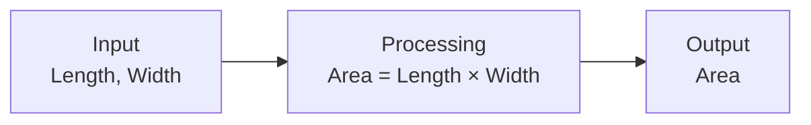

This is the beginning of problem solving.

---

# 35. Why Not Start Directly With Code?

A common beginner mistake is:

> Read the problem → immediately start writing code.

This can cause:

- Incorrect logic.
- Missing requirements.
- Difficult debugging.
- Unnecessary complexity.
- Poor program structure.

A better approach is:

```text
Problem
   ↓
Understand
   ↓
Analyze
   ↓
Design Solution
   ↓
Algorithm
   ↓
Flowchart
   ↓
Code
   ↓
Test
```

The purpose of an algorithm is to make the logic clear **before** implementation.

---

# 36. What is an Algorithm?

An **algorithm** is a finite, ordered sequence of well-defined steps used to solve a problem or perform a computation.

In simple words:

> **An algorithm is a step-by-step procedure for solving a problem.**

Example:

Problem:

> Find the sum of two numbers.

Algorithm:

```text
Step 1: Start
Step 2: Read A and B
Step 3: Calculate SUM = A + B
Step 4: Display SUM
Step 5: Stop
```

---

# 37. Characteristics of an Algorithm

A good algorithm should have the following characteristics.

## 1. Input

An algorithm may accept zero or more inputs.

Example:

```text
A
B
```

## 2. Output

An algorithm should produce at least one result or output for the intended problem.

Example:

```text
SUM
```

## 3. Definiteness

Every step should be clear and unambiguous.

Bad:

```text
Process the number appropriately.
```

Better:

```text
Calculate SUM = A + B.
```

## 4. Finiteness

The algorithm should terminate after a finite number of steps.

## 5. Effectiveness

Each step should be sufficiently basic and executable in practice.

---

# 38. Five Important Properties

The five commonly taught properties are:

```text
Input
Output
Definiteness
Finiteness
Effectiveness
```

Easy way to remember:

```text
I O D F E
```

Or:

```text
I → Input
O → Output
D → Definiteness
F → Finiteness
E → Effectiveness
```

---

# 39. Algorithm Example — Addition of Two Numbers

### Problem

> Write an algorithm to add two numbers.

### Analysis

```text
Input:
A, B

Processing:
SUM = A + B

Output:
SUM
```

### Algorithm

```text
Step 1: Start
Step 2: Read A and B
Step 3: SUM ← A + B
Step 4: Display SUM
Step 5: Stop
```

Here:

- Input → `A`, `B`
- Processing → `A + B`
- Output → `SUM`

---

# 40. Algorithm Example — Find Area of Rectangle

### Problem

> Find the area of a rectangle.

### Input

```text
Length
Width
```

### Formula

```text
Area = Length × Width
```

### Algorithm

```text
Step 1: Start
Step 2: Read Length and Width
Step 3: Area ← Length × Width
Step 4: Display Area
Step 5: Stop
```

---

# 41. Algorithm Example — Find Average of Three Numbers

### Problem

> Calculate the average of three numbers.

### Input

```text
A, B, C
```

### Processing

```text
SUM = A + B + C
AVERAGE = SUM / 3
```

### Algorithm

```text
Step 1: Start
Step 2: Read A, B and C
Step 3: SUM ← A + B + C
Step 4: AVERAGE ← SUM / 3
Step 5: Display AVERAGE
Step 6: Stop
```

---

# 42. Algorithm Example — Find the Larger of Two Numbers

### Problem

> Find the larger of two numbers.

### Input

```text
A
B
```

### Algorithm

```text
Step 1: Start
Step 2: Read A and B
Step 3: If A > B, display A
Step 4: Otherwise, display B
Step 5: Stop
```

Notice that this algorithm contains a **decision**.

This connects with the three fundamental control structures introduced in Module 1:

```text
Sequence
Decision
Repetition
```

We will study these more deeply in later lectures.

---

# 43. Algorithm Example — Find Whether a Number is Even or Odd

### Problem

> Determine whether a number is even or odd.

### Input

```text
N
```

### Logic

A number is even if:

```text
N % 2 = 0
```

### Algorithm

```text
Step 1: Start
Step 2: Read N
Step 3: If N % 2 = 0, display "Even"
Step 4: Otherwise, display "Odd"
Step 5: Stop
```

The algorithm contains:

- Input
- Decision
- Output
- Termination

---

# 44. Algorithm and Program

An algorithm and a program are not the same thing.

| Algorithm | Program |
|---|---|
| Logical solution to a problem | Implementation of a solution |
| Language independent | Written in a programming language |
| Focuses on logic | Focuses on syntax + logic |
| Can be written using simple steps | Must follow programming language rules |
| Developed before implementation | Created from the algorithm |

Example:

### Algorithm

```text
Read A and B
Calculate SUM = A + B
Display SUM
```

### C Program

```c
#include <stdio.h>

int main()
{
    int a, b, sum;

    scanf("%d %d", &a, &b);

    sum = a + b;

    printf("%d", sum);

    return 0;
}
```

The C program implements the logic described by the algorithm.

---

# 45. Algorithm → Flowchart → Program

A common problem-solving sequence is:

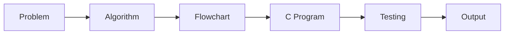

The algorithm describes the logic in textual steps.

The flowchart represents the logic graphically.

The program implements the logic using a programming language.

---

# 46. Algorithm vs Flowchart

| Algorithm | Flowchart |
|---|---|
| Textual representation | Graphical representation |
| Uses steps | Uses symbols and arrows |
| Easy to write | Easy to visualize |
| Good for describing detailed logic | Good for understanding flow |
| Language independent | Language independent |

Example:

### Algorithm

```text
Start
Read A and B
SUM = A + B
Display SUM
Stop
```

### Flowchart

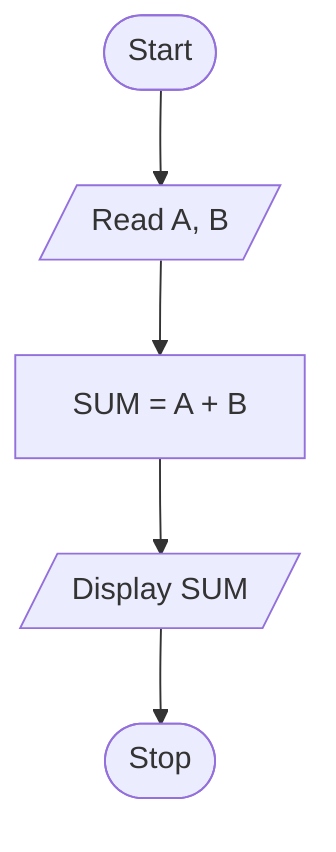

---

# 47. Three Basic Constructs of Algorithms

The syllabus specifically identifies three fundamental constructs:

1. **Sequence**
2. **Decision / Selection**
3. **Repetition / Iteration**

These three constructs form the foundation of structured programming.

```text
Structured Programming
        ↓
+-------+-------+-------+
|       |       |       |
Sequence Decision Repetition
```

---

# 48. Sequence

In a **sequence**, instructions are executed one after another in the specified order.

Example:

```text
Step 1: Read A
Step 2: Read B
Step 3: SUM = A + B
Step 4: Display SUM
```

Flow:

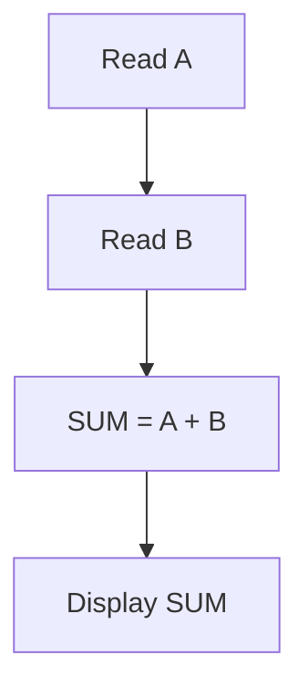

There is no decision and no repetition.

---

# 49. Decision / Selection

A **decision** allows an algorithm to choose between alternatives based on a condition.

Example:

```text
If marks >= 40
    Display "Pass"
Else
    Display "Fail"
```

Flow:

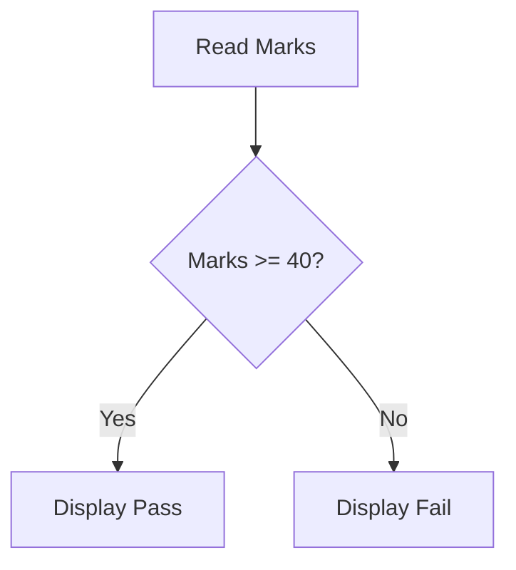

In C, this is commonly implemented using:

```c
if
if-else
switch
```

These will be studied in detail in Module 3.

---

# 50. Repetition / Iteration

**Repetition** means executing a set of instructions repeatedly while a condition or rule requires it.

Example:

```text
Print numbers from 1 to 5
```

Conceptually:

```text
1
2
3
4
5
```

Flow:

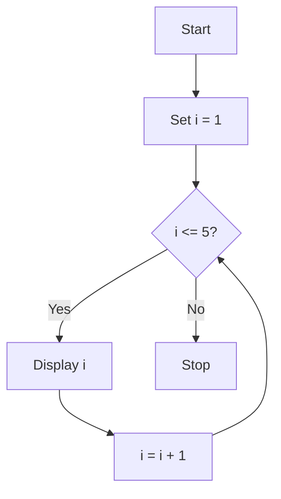

In C, repetition is commonly implemented using:

```c
while
do-while
for
```

These will be studied in Module 3.

---

# 51. Three Constructs — Quick Comparison

| Construct | Main Idea | Example |
|---|---|---|
| Sequence | Execute steps in order | `A = B + C` |
| Decision | Choose based on condition | `if marks >= 40` |
| Repetition | Repeat steps | `for i = 1 to 10` |

Remember:

```text
SEQUENCE
    ↓
Do this
    ↓
Then this
    ↓
Then this
```

```text
DECISION
    ↓
Condition?
  ↙     ↘
Yes     No
 ↓       ↓
Action  Action
```

```text
REPETITION
    ↓
Condition?
  ↙     ↘
Yes     No
 ↓       ↓
Repeat  Stop
  ↑
  └──────┘
```

---

# 52. Why Algorithms Are Important

Algorithms help programmers:

- Understand a problem.
- Organize logical thinking.
- Identify inputs and outputs.
- Break complex problems into smaller steps.
- Detect logical mistakes before coding.
- Communicate solutions.
- Convert solutions into programs.
- Compare alternative solutions.
- Improve program design.

For example:

```text
Without Algorithm

Problem → Code → Errors → Confusion
```

Better:

```text
Problem
   ↓
Analysis
   ↓
Algorithm
   ↓
Flowchart
   ↓
Code
   ↓
Testing
```

---

# 53. Algorithm and Programming Efficiency

An algorithm is not only about obtaining the correct answer.

A good algorithm should also consider:

- Number of steps.
- Memory usage.
- Time required.
- Simplicity.
- Correctness.
- Scalability.

For example, suppose we need to search for a value in a collection.

Two different algorithms may both produce the correct answer, but one may require fewer operations.

Therefore:

> **Algorithm design is an important part of efficient programming.**

Detailed analysis of algorithm efficiency will be studied in later subjects/topics such as Data Structures and Algorithms.

---

# 54. Problem-Solving Example — Student Marks

Consider:

> **Determine whether a student has passed or failed.**

Assume passing marks are `40`.

### Step 1 — Identify Input

```text
Marks
```

### Step 2 — Identify Processing

```text
If Marks >= 40
    Pass
Else
    Fail
```

### Step 3 — Identify Output

```text
"Pass"
or
"Fail"
```

### Step 4 — Algorithm

```text
Step 1: Start
Step 2: Read Marks
Step 3: If Marks >= 40, go to Step 4; otherwise go to Step 5
Step 4: Display "Pass" and go to Step 6
Step 5: Display "Fail"
Step 6: Stop
```

### Step 5 — Flowchart

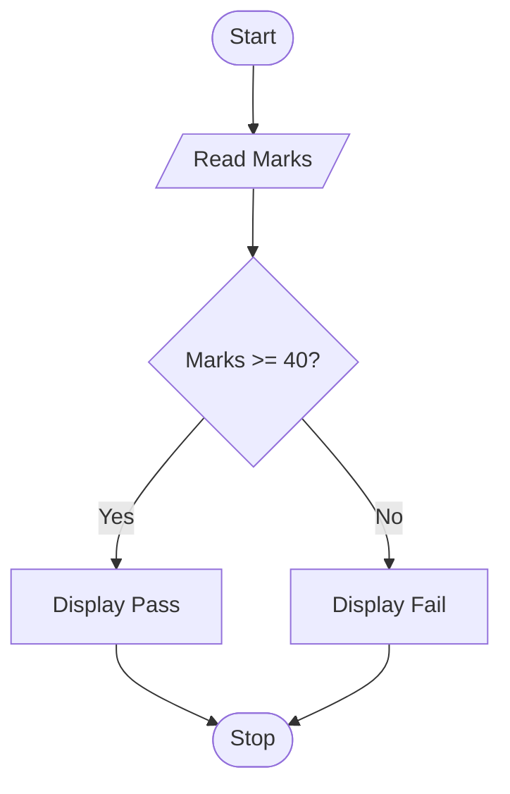

### Step 6 — C Implementation

```c
#include <stdio.h>

int main()
{
    int marks;

    scanf("%d", &marks);

    if (marks >= 40)
        printf("Pass");
    else
        printf("Fail");

    return 0;
}
```

The same logic is represented at three levels:

```text
Problem
   ↓
Algorithm
   ↓
Flowchart
   ↓
C Program
```

---

# 55. Important Difference: Syntax vs Logic

Two important concepts in programming are:

## Syntax

**Syntax** refers to the rules for writing valid statements in a programming language.

Example in C:

```c
printf("Hello");
```

Incorrect syntax may cause a compilation error.

## Logic

**Logic** refers to whether the program correctly solves the intended problem.

A program can have:

```text
Correct Syntax
+
Incorrect Logic
```

and still produce the wrong answer.

Example:

```c
average = (a + b + c) / 2;
```

The syntax may be valid, but the logic is wrong if the average of three numbers is required.

The correct formula is:

```c
average = (a + b + c) / 3;
```

This is why algorithm design is important before coding.

---

# 56. Common Mistakes While Designing Algorithms

### Mistake 1 — Missing Input

Example:

```text
Calculate Area
```

without identifying:

```text
Length
Width
```

### Mistake 2 — Missing Output

The algorithm calculates a value but never specifies that the result should be displayed or returned.

### Mistake 3 — Ambiguous Steps

Bad:

```text
Process the data.
```

Better:

```text
Calculate SUM = A + B.
```

### Mistake 4 — Infinite Repetition

A loop or repeated process does not have a condition that eventually becomes false.

### Mistake 5 — Incorrect Formula

The algorithm must use the correct mathematical relationship.

### Mistake 6 — Mixing Programming Syntax Too Early

An algorithm should focus primarily on logic rather than the syntax of C.

---

# 57. Algorithm Writing Guidelines

When writing an algorithm:

1. Start with a clear **Start** step.
2. Identify all required inputs.
3. Write one logical action per step where practical.
4. Use clear and unambiguous language.
5. Use meaningful variable names.
6. Specify calculations explicitly.
7. Clearly represent decisions.
8. Clearly represent repetition.
9. Specify the required output.
10. End with a **Stop** step.
11. Check whether the algorithm terminates.
12. Test the algorithm using sample inputs.

---

# 58. Algorithm Testing Using a Dry Run

A **dry run** means manually executing an algorithm using sample input values.

Example:

Algorithm:

```text
Step 1: Start
Step 2: Read A and B
Step 3: SUM = A + B
Step 4: Display SUM
Step 5: Stop
```

Suppose:

```text
A = 10
B = 25
```

Dry run:

| Step | A | B | SUM | Action |
|---|---:|---:|---:|---|
| Read input | 10 | 25 | — | Read A and B |
| Calculate | 10 | 25 | 35 | `SUM = A + B` |
| Display | 10 | 25 | 35 | Display 35 |

Output:

```text
35
```

Dry runs help identify logical errors before writing or testing the final program.

---

# 59. A Complete Problem-Solving Framework

For structured programming, we can use:

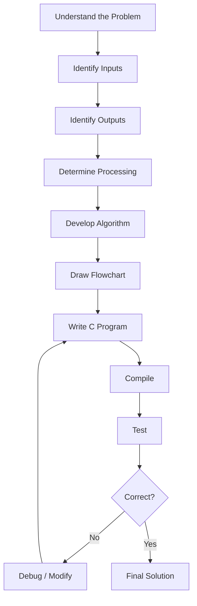

This process will be used throughout the course.

---

# 60. Connection to Structured Programming

Structured programming emphasizes organizing programs using clear control structures.

The three fundamental constructs are:

```text
Sequence
Decision
Repetition
```

These constructs are used to build algorithms.

Later, we will implement them in C using:

```text
Sequence
    ↓
Statements

Decision
    ↓
if / if-else / switch

Repetition
    ↓
while / do-while / for
```

Therefore:

```text
Algorithmic Constructs
        ↓
C Control Structures
        ↓
Structured Programs
```

---

# 61. Programming Language Translation — Overall Picture

The concepts from Lecture 01 and Lecture 02 can now be connected.

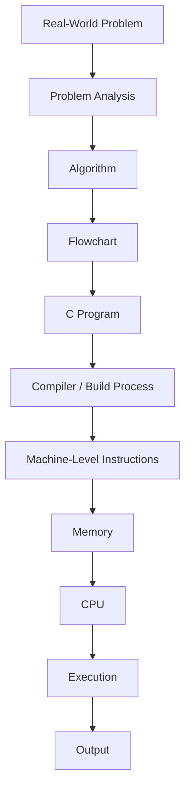

This is the overall journey from a problem to a computer-executed solution.

---

# 62. Example — From Problem to C Program

### Problem

> Calculate the area of a circle.

### Input

```text
Radius
```

### Formula

```text
Area = π × Radius × Radius
```

### Algorithm

```text
Step 1: Start
Step 2: Read Radius
Step 3: Area ← 3.14159 × Radius × Radius
Step 4: Display Area
Step 5: Stop
```

### Flowchart

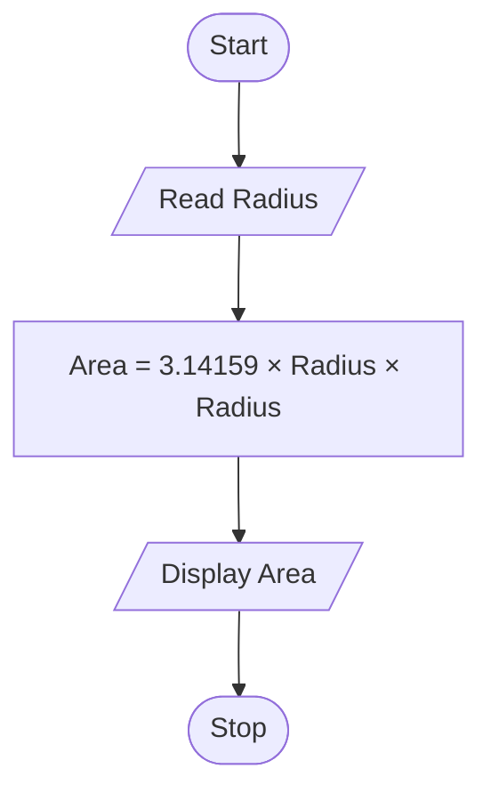

### C Program

```c
#include <stdio.h>

int main()
{
    float radius, area;

    scanf("%f", &radius);

    area = 3.14159f * radius * radius;

    printf("%f", area);

    return 0;
}
```

Notice the progression:

```text
Problem
   ↓
Input / Processing / Output
   ↓
Algorithm
   ↓
Flowchart
   ↓
C Program
```

---

# 63. Important Terminology

| Term | Meaning |
|---|---|
| **Programming Language** | A formal language used to express instructions for solving computational problems. |
| **Machine Language** | Low-level instructions represented in machine-readable form and directly associated with a processor architecture. |
| **Assembly Language** | Low-level language using symbolic mnemonics for processor instructions. |
| **Mnemonic** | Symbolic abbreviation representing an operation. |
| **Assembler** | Software that translates assembly language into machine code. |
| **High-Level Language** | Programming language that provides higher-level abstractions and human-readable constructs. |
| **Compiler** | Software that translates source code as part of a compilation process. |
| **Interpreter** | Software/runtime that executes source code or an intermediate representation through interpretation and/or runtime mechanisms. |
| **1GL** | First-generation language; traditionally machine language. |
| **2GL** | Second-generation language; traditionally assembly language. |
| **3GL** | Third-generation language; high-level programming languages. |
| **4GL** | Very high-level or domain-oriented languages. |
| **5GL** | Languages/systems associated with logic, constraints, or knowledge-oriented problem solving. |
| **Problem Solving** | Process of understanding a problem and developing a correct computational solution. |
| **Algorithm** | A finite sequence of well-defined steps for solving a problem. |
| **Sequence** | Execution of instructions in a specified order. |
| **Decision / Selection** | Choosing an action based on a condition. |
| **Repetition / Iteration** | Repeated execution of instructions. |
| **Flowchart** | Graphical representation of an algorithm or process. |
| **Syntax** | Rules governing how statements are written in a programming language. |
| **Logic** | Reasoning and relationships that determine whether a solution solves the problem correctly. |
| **Dry Run** | Manual execution of an algorithm or program using sample values. |

---

# 64. Check Your Understanding

## Question 1

What is a programming language?

**Answer:**  
A programming language is a formal language used to write instructions and computational solutions that can be translated and executed by a computer.

---

## Question 2

What is machine language?

**Answer:**  
Machine language consists of machine-readable instructions directly associated with a processor architecture.

---

## Question 3

What is assembly language?

**Answer:**  
Assembly language is a low-level language that uses symbolic mnemonics to represent processor instructions.

---

## Question 4

What is an assembler?

**Answer:**  
An assembler translates assembly language instructions into machine code.

---

## Question 5

What is a high-level programming language?

**Answer:**  
A high-level programming language provides human-readable programming constructs and abstracts many hardware-level details.

---

## Question 6

What is a compiler?

**Answer:**  
A compiler is software that translates source code as part of a compilation process into a form that can ultimately be executed.

---

## Question 7

What is an algorithm?

**Answer:**  
An algorithm is a finite sequence of well-defined steps used to solve a problem or perform a computation.

---

## Question 8

What are the five common characteristics of an algorithm?

**Answer:**

1. Input
2. Output
3. Definiteness
4. Finiteness
5. Effectiveness

---

## Question 9

What are the three basic constructs of an algorithm?

**Answer:**

1. Sequence
2. Decision / Selection
3. Repetition / Iteration

---

## Question 10

Why should an algorithm be developed before writing a program?

**Answer:**  
An algorithm helps organize the logic of the solution, identify errors early, and provide a clear plan for implementation.

---

## Question 11

Where does C fit in the traditional language-generation classification?

**Answer:**  
C is generally classified as a third-generation high-level programming language.

---

## Question 12

Differentiate between an algorithm and a program.

**Answer:**  
An algorithm is a language-independent logical solution, while a program is an implementation of that solution using a programming language.

---

# 65. Practice Questions

## Short Answer Questions

1. Define a programming language.
2. Why are programming languages required?
3. What is machine language?
4. State two characteristics of machine language.
5. What is assembly language?
6. What is a mnemonic?
7. What is an assembler?
8. What is a high-level language?
9. What is a compiler?
10. What is an interpreter?
11. What is 1GL?
12. What is 2GL?
13. What is 3GL?
14. What is 4GL?
15. What is 5GL?
16. Which generation does C belong to?
17. Why is C useful for learning programming?
18. What is problem solving?
19. Define an algorithm.
20. What are the characteristics of a good algorithm?
21. What is sequence?
22. What is decision?
23. What is repetition?
24. What is a flowchart?
25. What is a dry run?

---

## Descriptive Questions

1. Explain the need for programming languages.
2. Explain machine language with its advantages and disadvantages.
3. Explain assembly language and the role of an assembler.
4. Explain high-level programming languages with examples.
5. Differentiate between machine language, assembly language and high-level languages.
6. Explain the traditional generations of programming languages.
7. Explain why C is considered a third-generation language.
8. Explain the importance of C programming for AIML students.
9. Explain the problem-solving process in programming.
10. Define an algorithm and explain its characteristics.
11. Explain the three basic constructs of an algorithm.
12. Explain sequence, decision and repetition with examples.
13. Differentiate between an algorithm and a program.
14. Explain the relationship between algorithm, flowchart and program.
15. Explain why an algorithm should be designed before coding.

---

# 66. Class Activity

## Activity 1 — Identify the Language Level

Identify whether each example represents machine language, assembly language, or a high-level language.

### Example A

```text
10110000 01100001
```

### Example B

```asm
MOV AX, 10
ADD AX, 20
```

### Example C

```c
sum = a + b;
```

### Answers

```text
A → Machine Language
B → Assembly Language
C → High-Level Language
```

---

## Activity 2 — Identify Input, Processing and Output

Problem:

> Calculate the total price of 5 products when the price of each product is given.

Identify:

```text
Input:
?

Processing:
?

Output:
?
```

One possible answer:

```text
Input:
Price of each product

Processing:
Total = Price × 5

Output:
Total price
```

---

## Activity 3 — Write an Algorithm

Write an algorithm for:

> Calculate the perimeter of a rectangle.

Formula:

```text
Perimeter = 2 × (Length + Width)
```

Expected structure:

```text
Step 1: Start
Step 2: ...
Step 3: ...
Step 4: ...
Step 5: Stop
```

---

## Activity 4 — Identify the Construct

Identify whether each situation represents **Sequence, Decision, or Repetition**.

### A

```text
Read A
Read B
SUM = A + B
Display SUM
```

### B

```text
If age >= 18
    Display "Eligible"
Else
    Display "Not Eligible"
```

### C

```text
Print numbers from 1 to 10
```

### Answers

```text
A → Sequence
B → Decision
C → Repetition
```

---

# 67. Mini Assignment

Write algorithms for the following problems:

### 1. Calculate the area of a square.

Input:

```text
Side
```

Formula:

```text
Area = Side × Side
```

### 2. Calculate simple interest.

Formula:

```text
SI = (P × R × T) / 100
```

### 3. Find the larger of two numbers.

### 4. Determine whether a number is positive, negative, or zero.

### 5. Print numbers from 1 to 10.

For each problem, identify:

```text
1. Input
2. Processing
3. Output
4. Algorithm
5. Which basic construct is involved?
```

---

# 68. Exam-Oriented Revision

## Must Know

- Definition of programming language.
- Need for programming languages.
- Machine language.
- Assembly language.
- Mnemonics.
- Assembler.
- High-level language.
- Compiler.
- Interpreter.
- Difference between machine, assembly and high-level languages.
- Programming language generations.
- 1GL, 2GL, 3GL, 4GL, 5GL.
- Position of C in the traditional classification.
- Importance of C.
- Problem solving.
- Definition of algorithm.
- Characteristics of an algorithm.
- Sequence.
- Decision.
- Repetition.
- Algorithm vs program.
- Algorithm vs flowchart.

---

# 69. Important Conceptual Questions

### Question 1

> **Explain the different levels of programming languages.**

A good answer should include:

1. Machine language.
2. Assembly language.
3. High-level language.
4. Characteristics of each.
5. Examples.
6. Translation mechanism.
7. Comparison.

---

### Question 2

> **Explain the characteristics of an algorithm.**

A good answer should include:

1. Input.
2. Output.
3. Definiteness.
4. Finiteness.
5. Effectiveness.
6. Suitable example.

---

### Question 3

> **Explain the three basic constructs of algorithms.**

A good answer should include:

1. Sequence.
2. Decision / Selection.
3. Repetition / Iteration.
4. Example of each.
5. Suitable flowchart.

---

### Question 4

> **Differentiate between an algorithm and a program.**

Focus on:

- Purpose.
- Representation.
- Language dependency.
- Syntax.
- Implementation.
- Relationship.

---

# 70. Quick Revision

```text
PROGRAMMING LANGUAGES

Machine Language
       ↓
Binary / Machine Instructions
       ↓
CPU
```

```text
Assembly Language
       ↓
Mnemonics
       ↓
Assembler
       ↓
Machine Code
       ↓
CPU
```

```text
High-Level Language
       ↓
C / C++ / Java / Python
       ↓
Compiler / Runtime
       ↓
Machine-Level Execution
```

```text
LANGUAGE GENERATIONS

1GL → Machine
2GL → Assembly
3GL → High-Level
4GL → Very High-Level / Domain-Oriented
5GL → Logic / Constraint / Knowledge-Oriented
```

```text
PROBLEM SOLVING

Problem
   ↓
Analysis
   ↓
Input / Processing / Output
   ↓
Algorithm
   ↓
Flowchart
   ↓
Program
   ↓
Testing
   ↓
Solution
```

```text
ALGORITHM

Input
  +
Processing
  +
Output
  +
Clear Steps
  +
Finite Execution
  ↓
Solution
```

```text
THREE BASIC CONSTRUCTS

Sequence
    ↓
Decision
    ↓
Repetition
```

---

# 71. Key Takeaways

1. A **programming language** allows humans to express computational solutions in a structured form.
2. **Machine language** consists of machine-level instructions directly associated with a processor.
3. **Assembly language** uses mnemonics to represent low-level operations.
4. An **assembler** translates assembly language into machine code.
5. **High-level languages** provide more human-readable abstractions.
6. A **compiler** translates source code as part of a compilation process.
7. Programming languages are traditionally classified into generations from **1GL to 5GL**.
8. **C is generally classified as a third-generation language**.
9. Problem solving begins with understanding and analyzing the problem.
10. An **algorithm** is a finite sequence of well-defined steps for solving a problem.
11. Important algorithm characteristics include **input, output, definiteness, finiteness and effectiveness**.
12. The three basic constructs are **sequence, decision and repetition**.
13. An algorithm describes the logic; a program implements that logic.
14. Algorithms help reduce logical errors before coding.
15. The general development path is:

```text
Problem
   ↓
Algorithm
   ↓
Flowchart
   ↓
C Program
   ↓
Testing
   ↓
Output
```

---

# 72. Next Lecture

## Lecture 03 — Flowcharts and Flowchart Symbols

The next lecture will continue Module 1 and cover:

- What is a flowchart?
- Why flowcharts are used.
- Advantages and limitations of flowcharts.
- Standard flowchart symbols.
- Terminal symbol.
- Input/Output symbol.
- Process symbol.
- Decision symbol.
- Flow lines.
- Connectors.
- Rules for drawing flowcharts.
- Sequence flowcharts.
- Decision-based flowcharts.
- Repetition-based flowcharts.
- Converting algorithms into flowcharts.
- Solving programming problems using algorithms and flowcharts.

The focus will be on converting **step-by-step algorithms into graphical representations**.

---

# 73. Final Connection

The first two lectures have established the foundation:

```text
LECTURE 01
Computer + Computation
        ↓
Turing Model
        ↓
Von Neumann Model
```

```text
LECTURE 02
Programming Languages
        ↓
Machine → Assembly → High-Level
        ↓
Problem Solving
        ↓
Algorithm
        ↓
Sequence / Decision / Repetition
```

The next step is:

```text
Algorithm
    ↓
Flowchart
```

> **The goal of Structured Programming is not merely to write code, but to develop a systematic method for solving problems and expressing those solutions clearly.**
